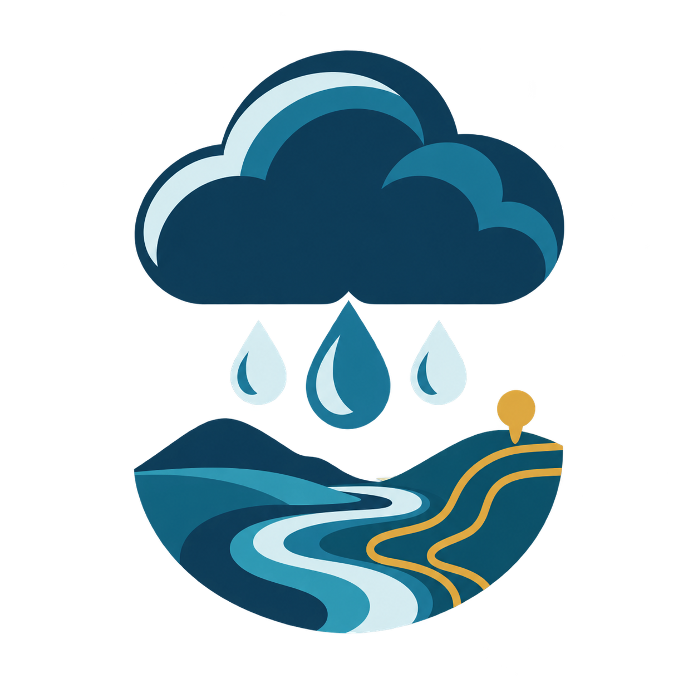

<div align="center">
  

  # Antes da Chuva

  **Inteligência pública municipal para compreender riscos e fortalecer a prevenção.**

  [](https://antesdachuva.info)
  [](https://github.com/rasterxtech/antes-da-chuva/actions/workflows/ci.yml)
  [](docs/FONTES_DE_DADOS.md)
</div>


O **Antes da Chuva** transforma bases públicas dispersas em uma leitura municipal curta, rastreável e acessível. Ao buscar uma cidade, a pessoa encontra o histórico de ocorrências ligadas à chuva, uma condição estrutural que pode ampliar danos, evidências de prevenção financiada pela União e caminhos oficiais para receber alertas.

O projeto foi criado para o **2º Concurso de Reúso de Dados Abertos da CGU, edição 2026**.

## Produto

A experiência foi desenhada para responder, em menos de um minuto:

1. O que as chuvas já causaram neste município?
2. Qual condição estrutural pode ampliar o impacto?
3. Que ações federais de prevenção aparecem nas bases consultadas?
4. Onde receber alertas oficiais da Defesa Civil?

O produto não prevê desastres, não atribui nota de proteção e não trata a ausência de registros como prova de ausência de política pública.

## Funcionalidades

- Busca entre as 5.570 localidades brasileiras, usando o código IBGE como chave.
- Histórico municipal de cinco tipologias relacionadas à chuva entre 1991 e 2025.
- Indicador de saneamento do Censo Demográfico 2022.
- Evidências selecionadas de transferências e parcerias da União.
- Acesso direto aos canais oficiais de alerta da Defesa Civil.
- Fontes e limitações apresentadas junto de cada informação.
- Interface responsiva, acessível e otimizada para leitura rápida.

## Fontes públicas

| Fonte | Uso no produto | Observação |
| --- | --- | --- |
| [Atlas Digital de Desastres no Brasil](https://atlasdigital.mdr.gov.br/paginas/downloads.xhtml) | Registros municipais reconhecidos de alagamentos, enxurradas, inundações, movimentos de massa e chuvas intensas | Série de 1991 a 2025; registros administrativos podem conter lacunas |
| [Censo Demográfico 2022, tabela 6805](https://sidra.ibge.gov.br/tabela/6805) | Percentual de domicílios fora das formas selecionadas de esgotamento sanitário | Retrato censitário, não medição de risco hidrológico |
| [Transferências e Parcerias da União](https://dados.gov.br/dados/conjuntos-dados/transferencias-e-parcerias-da-uniao) | Programas e propostas federais selecionados por ação, objeto e atribuição municipal | Proposta não equivale a política municipal completa |
| [Defesa Civil](https://www.gov.br/mdr/pt-br/assuntos/protecao-e-defesa-civil/alertas-de-desastres-1) | Orientação para receber alertas oficiais | O site não emite nem replica alertas em tempo real |

A avaliação completa de qualidade, escopo e limites está em [Auditoria das fontes](docs/AUDITORIA_FONTES.md).

## Tecnologias

- React 19 e TypeScript
- Tailwind CSS
- Vite e Vinext
- Cloudflare Workers no artefato de produção
- Python para a consolidação reproduzível das bases

## Executar localmente

Pré-requisitos:

- Node.js 22.13 ou superior
- npm 10 ou superior

```bash
git clone git@github.com:rasterxtech/antes-da-chuva.git
cd antes-da-chuva/app
npm ci
npm run dev
```

A aplicação ficará disponível no endereço informado pelo terminal, normalmente `http://localhost:3000`.

Para validar o mesmo processo executado no CI:

```bash
cd app
npm ci
npm run lint
npm run build
```

## Pipeline de dados

As bases originais são grandes e permanecem fora do Git. O repositório mantém o script de transformação e o conjunto compacto que a aplicação consome.

Para exploração e testes rápidos, consulte as [amostras reduzidas para colaboradores](data/samples/README.md). Elas cobrem as 27 unidades federativas e casos de presença e ausência de dados nas três dimensões do produto.

Entradas locais esperadas:

```text
data/raw/atlas_1991_2025.xlsx
data/raw/censo_6805_percentual_rede.json
data/raw/siconv_programa.csv.zip
data/raw/siconv_programa_proposta.csv.zip
data/raw/siconv_proposta.csv.zip
data/raw/siconv_convenio.csv.zip
```

Geração do conjunto publicado:

```bash
python scripts/build_data.py
```

Saída versionada:

```text
app/public/data/municipios.json
```

## Estrutura do repositório

```text
antes-da-chuva/
├── app/                 aplicação web e conjunto municipal publicado
├── data/raw/            fontes originais locais, ignoradas pelo Git
├── data/processed/      derivados intermediários locais
├── docs/                metodologia, decisões e critérios do concurso
├── scripts/             pipeline reproduzível de dados
└── .github/             CI, segurança e modelos de colaboração
```

## Documentação

- [Plano mestre](docs/PLANO_MESTRE.md)
- [Critérios do concurso](docs/CRITERIOS_DO_CONCURSO.md)
- [Registro de decisões](docs/DECISOES.md)
- [Inventário de fontes](docs/FONTES_DE_DADOS.md)
- [Auditoria das fontes](docs/AUDITORIA_FONTES.md)

## Contribuição

Alterações na branch `main` são feitas exclusivamente por pull request, com build obrigatório e aprovação de outra pessoa. Consulte o [guia de contribuição](CONTRIBUTING.md) antes de começar.

Falhas de segurança não devem ser publicadas em issues. Siga as instruções da [política de segurança](SECURITY.md).

## Licença

A licença do código ainda será definida pelos responsáveis antes da submissão oficial. Os dados permanecem sujeitos aos termos e às condições de suas fontes de origem.

## Estado do projeto

MVP nacional funcional e publicado em [antesdachuva.info](https://antesdachuva.info). O desenvolvimento segue ativo para a submissão ao concurso da CGU em setembro de 2026.
