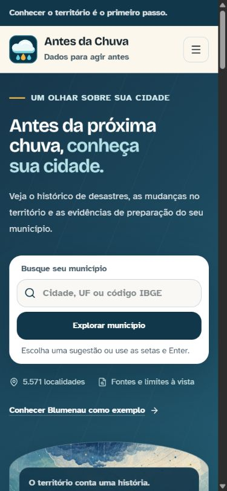
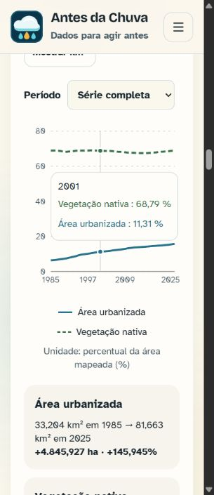

# Design editorial: implementação e homologação

Data: 08/09/2026. Candidato: `codex/design-atlas-editorial`, a partir de `staging` em `062f297dae819dede873500ec250b6238dbd4daa`.

Status: implementação e verificações locais concluídas; [PR #8 aberto para staging](https://github.com/rasterxtech/antes-da-chuva/pull/8). Revisão humana e deployment da staging ainda necessários. Nenhuma promoção para `main`, alteração de DNS ou redução de proteções faz parte desta entrega.

Commit de implementação: `48204ac7056b0f1eb93c6e333cc405504936bfbf`. O cabeçalho do PR identifica o candidato atual, incluindo eventuais atualizações documentais posteriores; o deployment a homologar deve corresponder a esse candidato.

## Mudanças entregues

- Identidade editorial com Bricolage nos títulos principais, Atkinson na leitura e nos números, azul-petróleo, papel claro e sinais gráficos diferenciados.
- Abertura compacta, ilustração existente com recorte em arco e legenda legível, símbolo vetorial já existente no header e no rodapé, busca antes da imagem no celular.
- Menu móvel com Escape, navegação entre capítulos e consulta com foco encaminhado ao resultado.
- Busca por nome/código e UF exata; texto preservado no refoco; ambiguidade exige escolha; sugestões por teclado permanecem visíveis.
- Resumo em duas ou quatro colunas conforme espaço e cobertura, capítulos numerados e comparação regional em linhas.
- Histórico em gráfico combinado, tooltip por identidade da série, contraste também por traçado, legendas externas e tabelas de valores expansíveis.
- Fontes de histórico e território próximas aos dados, inclusive nas ausências; catálogo e rodapé incluem MapBiomas.
- Menos movimento contínuo, respeito à redução de movimento e elevação por hover somente nos cartões acionáveis.

Não houve alteração de GOLD, exportador, cálculo dos indicadores, contrato v1, canais oficiais de alerta ou versões das dependências. Os metadados do pacote foram alinhados a `1.0.0` e `Apache-2.0`; não foi criada tag nem release de produção.

O README e os guias públicos foram atualizados para apresentar a v1 sem rótulos de fases. LICENSE, NOTICE e o guia de licenciamento registram a Apache 2.0 e os cinco titulares confirmados, em ordem alfabética.

## Verificações executadas

| Verificação | Resultado |
| --- | --- |
| `npm run lint` | Sem erros. |
| `npm test` | 16 testes aprovados, incluindo busca, refoco, ambiguidade, UF, teclado, menu, erros e ausências. |
| `npm run build` | Build Next.js e TypeScript aprovados; dados locais validados pelo prebuild. |
| `node --test .github/scripts/check-pr-target.test.cjs` | 8 testes da política de branches aprovados. |
| Navegador, larguras 320, 390, 768, 1024, 1280 e 1440 px | Inspeção visual dos fluxos principais e verificação de reflow; sem overflow horizontal da página ou de controles/gráficos nos estados conferidos. Não representa teste exaustivo de cada seção em cada largura. |
| Abertura a 390 × 844 | Campo e botão de consulta inteiros antes da ilustração. |
| Blumenau | 30 registros totais; último registro em 2025; resumo territorial mantém +145,95% de urbanização e -0,01% de vegetação. Não confundir com os 14 registros da comparação dos últimos dez anos. |
| Tooltip do histórico, 2018 em Blumenau | Município: 4; média regional: 0,8. Rótulos e valores conferidos na tela. |
| Território a 320 px | Eixos, legenda externa, tooltip, seletor e indicadores sem sobreposição na composição conferida. |
| Fernando de Noronha | Ausência MapBiomas explícita, sem métricas territoriais zeradas; resumo usa duas colunas. |
| Acrelândia | Caso real sem registro no Atlas selecionado na base local para conferência, além da cobertura por fixture. |

O build local usou o Node disponível na máquina; o projeto exige Node 22 e o CI deve confirmar esse runtime antes da integração.

O agente revisor independente conferiu o diff em duas rodadas. Os achados de foco, rolagem das sugestões, ausência e hierarquia tipográfica foram tratados. A inspeção com navegador foi executada pelo agente principal.

## Evidências visuais

Capturas do build de produção executado localmente; não são comprovação de publicação em STG. A referência anterior foi capturada no domínio público a 1280 × 720; a nova abertura desktop usa 1440 × 1000, portanto as alturas não são uma comparação de desempenho ou densidade.

## Pendências e limites

- Revisão de outra pessoa, checks do GitHub e integração do PR na staging. Regras efetivas consultadas exigem uma aprovação, aprovação do último envio, resolução das conversas e checks `Build` e `Branch policy`.
- Validar o deployment específico e o vínculo de `stg.antesdachuva.info` após o merge. Previews e STG mantêm a proteção de acesso existente da Vercel.
- Aceite visual do responsável pelo projeto; teste em celular físico, leitor de tela, zoom 200% e redução de movimento no sistema operacional.
- Medição comparativa de LCP/CLS com repetições e auditoria completa de contraste não executadas. Não se declara conformidade WCAG nem ganho de desempenho medido.
- A navegação ficou mais orientada, mas não se afirma redução da altura total da página. Notas legíveis e conteúdo acessível podem aumentar sua extensão.
- Favicon e ilustração existentes preservados. Nova imagem de compartilhamento e nova arte autoral ficam para avaliação posterior ao aceite desta direção.
- Alerta de dependência preexistente consultado em 08/09/2026: `pytest`, tratamento de diretórios temporários, severidade moderada, correção indicada em 9.0.3. O pacote de testes Python não foi atualizado por este PR visual; revisar separadamente antes da release, com a suíte Python. Isso não é uma varredura completa de segurança.

## Roteiro de aceite

1. Abrir o candidato sem município e avaliar marca, abertura e legibilidade em desktop/celular.
2. Buscar Blumenau por nome e código; experimentar uma UF, termo ambíguo, Escape e navegação por setas.
3. Ler o resumo e percorrer Histórico, Território e Preparação; alternar tipologia, unidade e período.
4. Conferir comparação regional, fontes, alertas oficiais e rodapé. Repetir com Acrelândia e Fernando de Noronha.
5. Registrar observações, URL do deployment, commit homologado e aceite. Somente então preparar promoção `staging → main`.

Rollback: se necessário, reverter o PR por uma nova branch e PR para staging. Não usar force push nem contornar regras de revisão.
